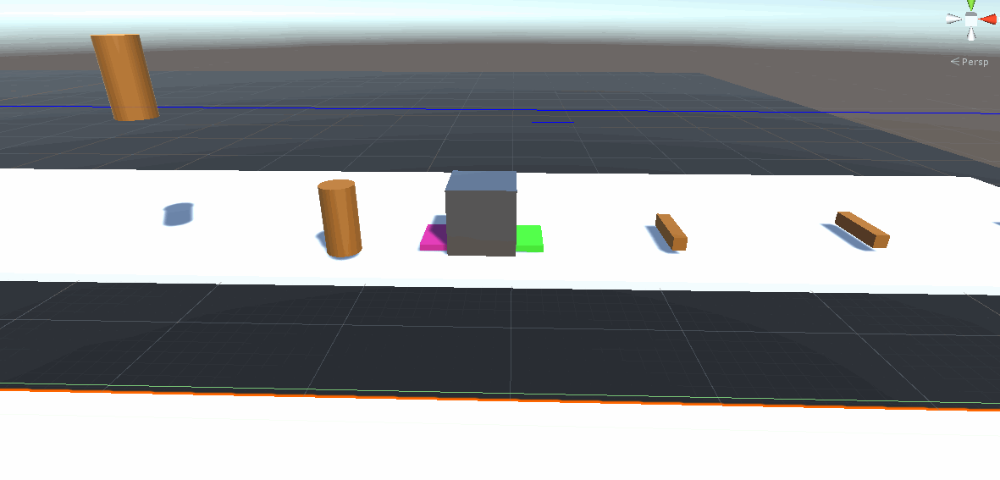
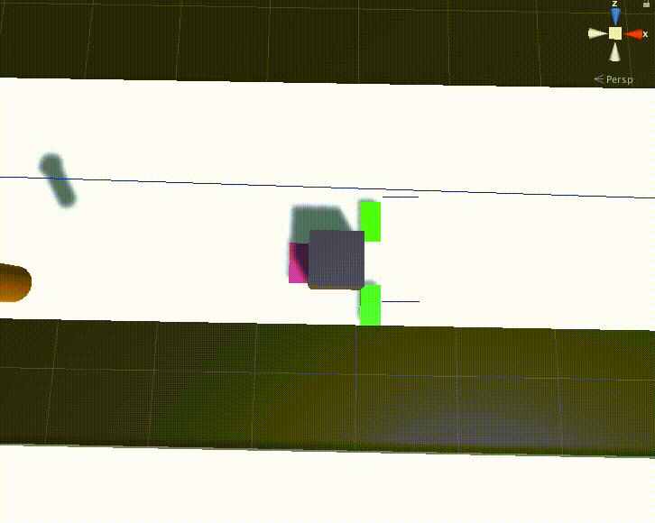
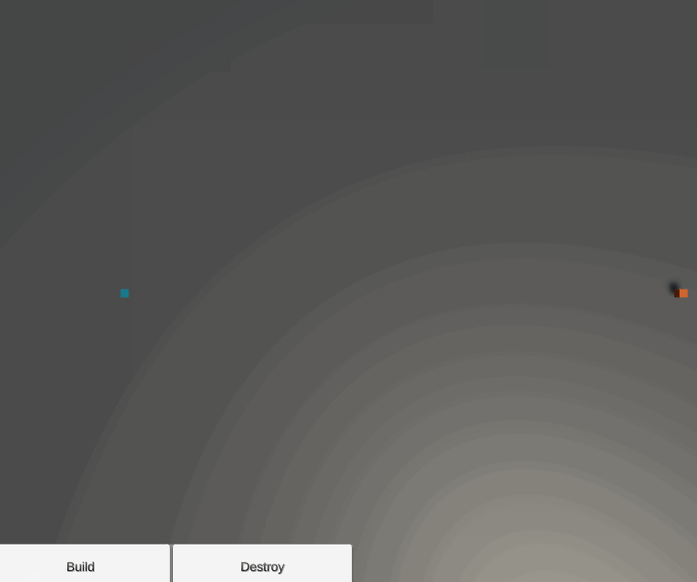
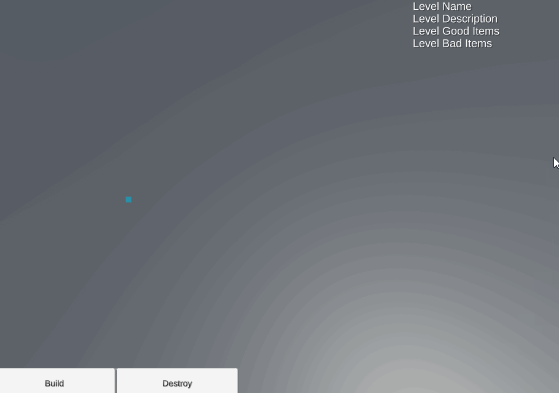

# War Machine

War Machine is a small game which challenges the player to use different buildings to beat each level. Levels are designed so the player can win in many different ways, allowing them to exercise creativity. Each level has a list of items that need to make it to Goal Platforms (blue squares) to pass and a list of items that if they touch a Trash Despawner (black square), they'll fail the level.

I had a few goals I had in mind when I started this project. I wanted to:

1. Get to play testing as soon as possible.
2. Design my software with a component architecture instead of object orientated architecture
3. Write small, independent, objects that can work without knowledge of the other objects in the map

After completing the bulk of the project, I was introduced to `ScriptableObject`s, `UnityEvent`s and custom `GameEvent`s. I believe that this knowledge would have allowed me to design a much more modular system. 

As with all software projects, this took me longer than I expected and that is reflected in the timestamps of the commits and the quality from start to finish. Near the end of the project, I wanted to just get it in a playable state, so the quality did suffer.

Overall, I learned:

- I'm not an artist
- The basics of the unity animator/animation
- That I should learn some basic modeling and animating in Blender
- The basics of a component based architecture
- Why `ScriptableObjects`, `UnityEvent` and custom `GameEvents` can help make cleaner more modular code
- How to load assets at runtime using the `Resources` folder
- How to make a pretty sweet main menu
- Handle different systems trying to operate on user input and how to use a `Stack` to ensure the right system gets the first chance to respond

If you're curious, I recorded gifs throughout my development and will show them here. :

> Been playing with Unity 3d and trying to get a conveyor belt to work. That arm is supposed to move the boxes, but right now it just physically interacts.

> Still playing with prototyping a game. Here's the progress on two arms. You can see my payload's scale is getting messed up mid animation. Looks pretty goofy!

> When you accidentally put in 1 ms and not 1 s, for spawning objects...

> Got a real basic cannon working!

> Got my first factory working!

> Got a splitter working! This way you could take on converyor's input and split it 50:50, across new conveyors!

> Where would a Splitter be without a merged?

> Got a fan working! I was accidentally threading a needle with my projectile and knocking over other items!

> Demonstrating my dynamically made menu. This is code written to inspect my folder structure and creates buttons dynamically!

> Playing with procedural materials for the first time. Checkout lava!

> Got a main menu working! At first it was just going to be text, but having the sample scene I've been using to test everything be playing in the background looks so good!

> Just got the ability to delete buildings working! This might now look like much, but it took quite a bit of work.

> Okay, the hardest feature to build thus far is done! The UI loads dynamically one each level's start and the UI will update when you've made progress towards winning or losing!

